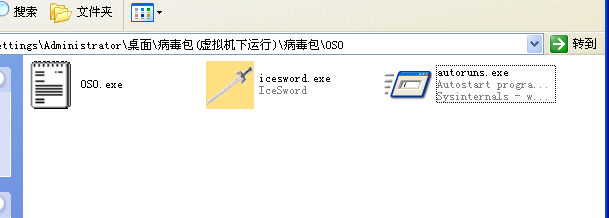
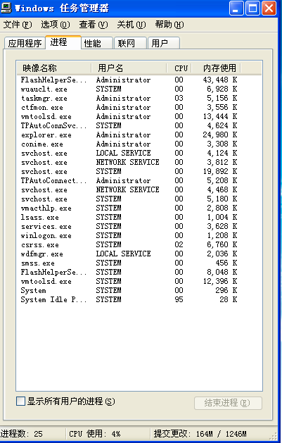
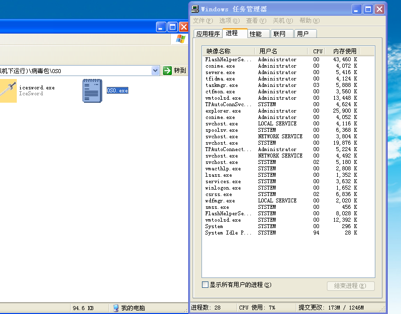
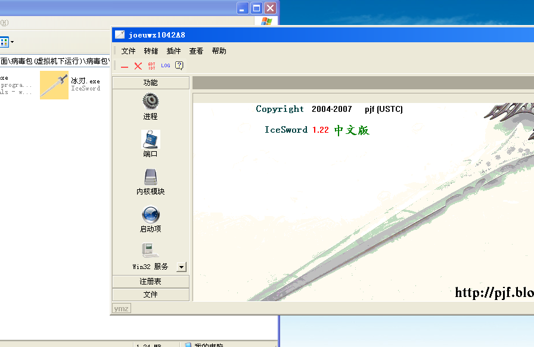
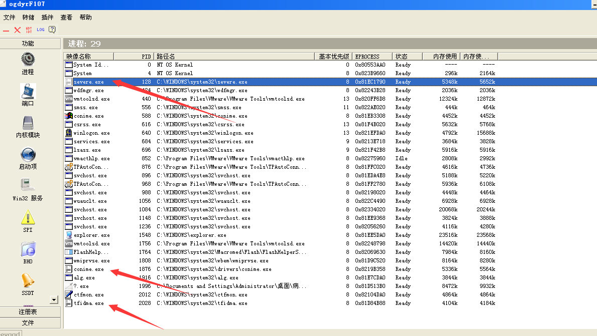
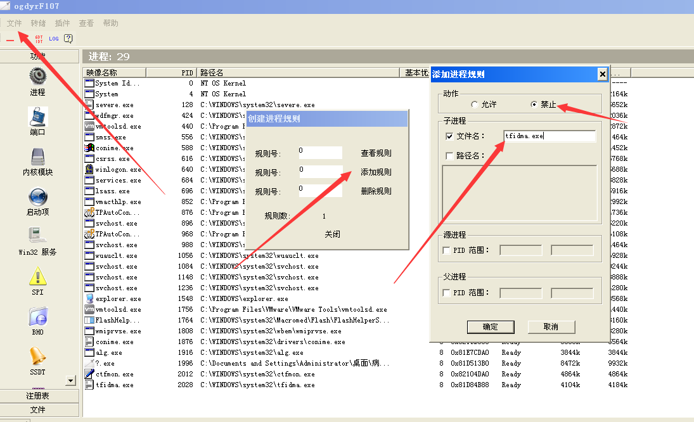
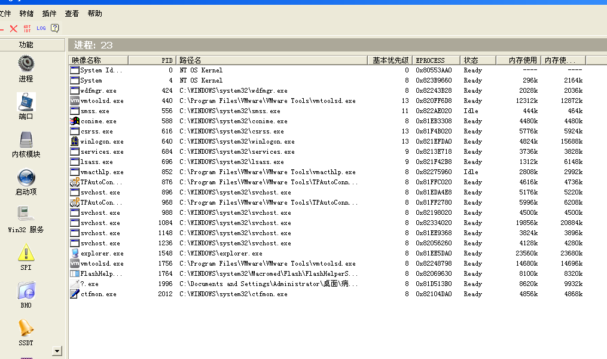
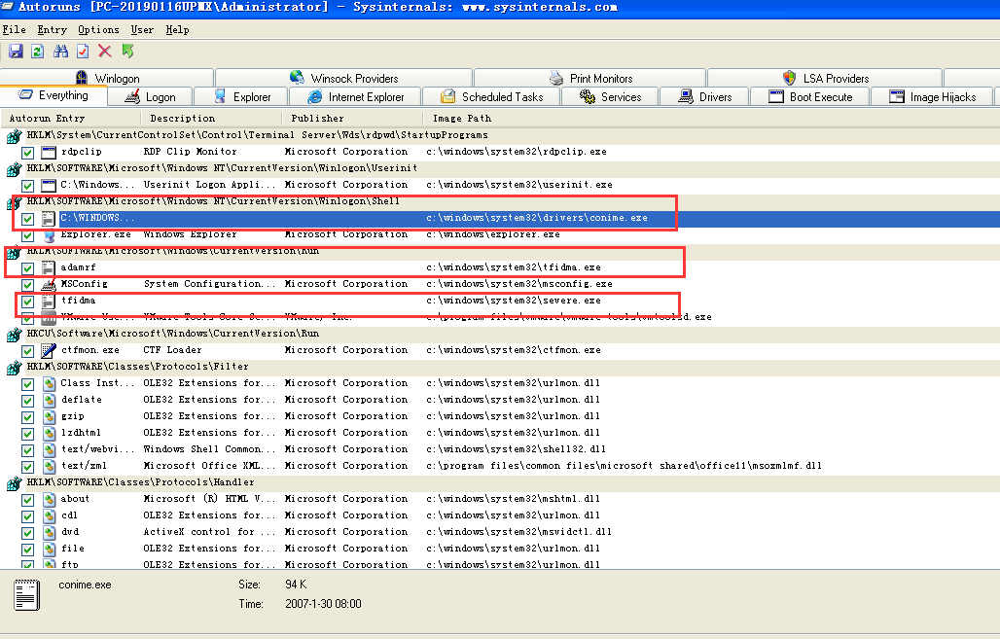
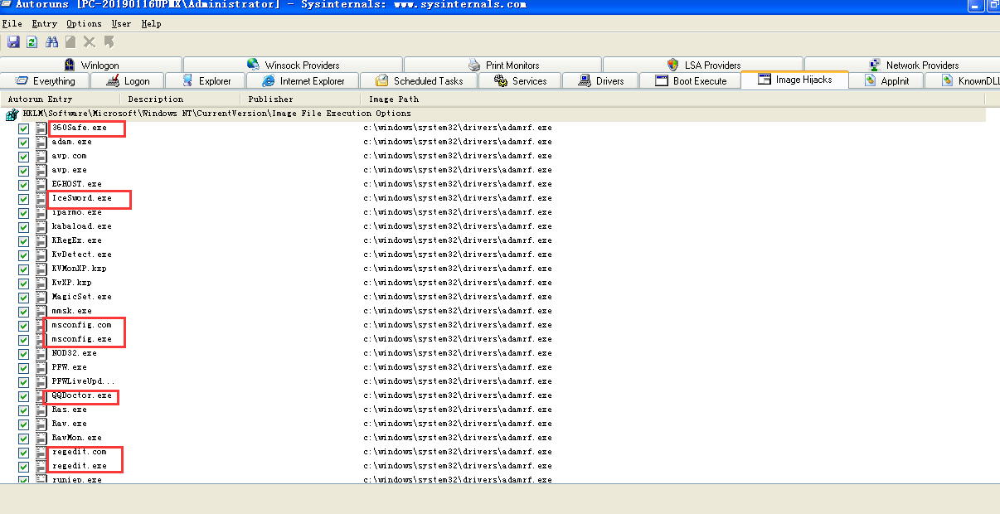

## 手动查杀病毒实战——QQ盗号木马

> 如果像自己实践记得在虚拟机下！
> 病毒包可以在Github仓库找到

### 目录

* [前言](#qy)
* [一.手杀分析](#ss)

### 前言

在总纲中我们基本介绍了手杀病毒的基本步骤，其中在进程中杀死病毒时我说过有些病毒只有一个进程，可以直接结束其进程，但有些病毒是多进程相互守护，关闭一个之后其他守护进程会将其重新启动。这就是病毒的一种自我保护技术，使得我们不能够使用常规手法对其实现查杀。我们需要借助两个工具——`icesword`与`autoruns`，以达到查杀的目的.

### 一.手杀分析

这是准备好的病毒样本，autoruns是一个注册表查看工具，icesword是一个非常强大的进程管理工具，不过icesword的平台兼容性很差，win10下我没有查到可用的，只有在xp虚拟机中使用过。

在运行病毒之前，先查看任务管理器中当前的进程。

在运行QQ盗号木马程序之后，可以发现进程数从`25`变为了`28`。

多出来的3个进程为`severe.exe`、`conime.exe`与`tfidma.exe`。

`conime.exe`进程是一个重要的系统进程，它不会随系统的启动而自动启动，只会在启动命令行（cmd）才会启动，但如果删除或者终止将导致特殊文字的输入困难，另外微软新版系统中此进程不会运行，而这里病毒则是伪造了这个进程。

尝试利用任务管理器将这三个进程其中之一结束时，会发现被终止的进程重新被启动了。

现在我们需要使用`icesword.exe`工具来讲三个互相守护的病毒进程终止。在双击启动`icesword.exe`时会发现这个工具并无法启动，可以理解为是病毒将这个工具屏蔽了，我们只需要给他改一个名字，`icesword.exe`的中文名`冰刃.exe`，之后双击启动。

在里面可用看到这三个进程。

点击`文件`，选择`创建进程规则`,`添加规则`，之后将三个进程添加进去。

再次终止进程之后发现病毒进程无法再次恢复。

接下来我们需要删除病毒的启动项，这里我们打开`autoruns`这个工具。

打开`autoruns`之后，初始界面`Everything`选项卡下面，很容易就发现了两个可疑启动项，因为它们作为可执行程序，使用了`记事本`图标，而且名称和路径与之前病毒进程相似。那么就有必要在这里删除这三个启动项了。选中欲删除的启动项，然后按下`Delete`键即可。接下来看一下非常重要的`Image Hijacks`标签。

可见`映像劫持`中大量软件进程都被映射为了病毒进程，比如我们熟悉的`360safe`,`注册表`,`服务配置`,`QQ医生`还有`icesword.exe`。在这里将这些注册表数据删除。

还有一些其他安全项，可用自行查看，病毒主体程序我们可用从注册表启动项中看到，去相应位置删除即可。