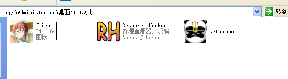
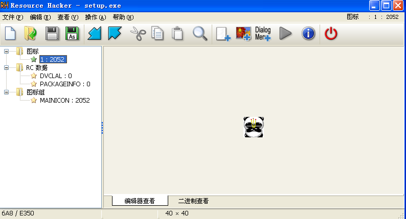
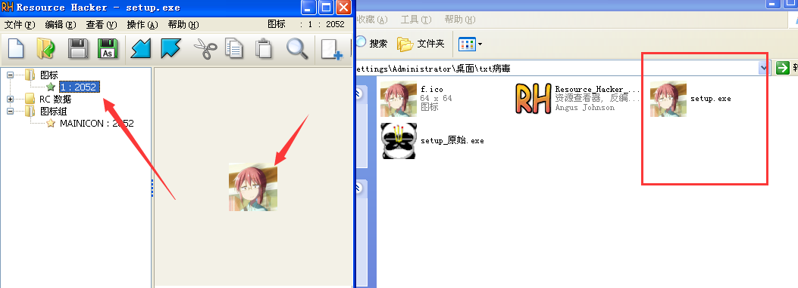
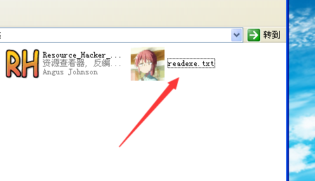
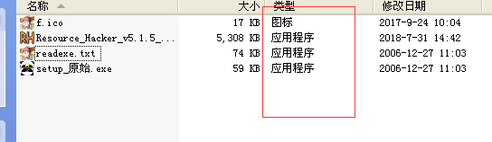

## 病毒分析实战——txt病毒研究

> 如果像自己实践记得在虚拟机下！
> 病毒包可以在Github仓库找到

### 目录

* [前言](#qy)
* [txt病毒引入](#txt1)
* [`RLO`与字符陷阱](#rlo)

### 前言

现在很多病毒使用了各式各样的隐藏技术。病毒编写者往往会用复杂高深的技术来武装自己的恶意程序，使其难以被发现难以被清除。隐藏类的病毒虽然很难发现，但危害清除往往比较简单，如前段时间出现的`比特币敲竹杠`病毒，就是一个基于Ring3层的病毒，其特色就在于采用了一定的算法来加密目标计算机中的相应文件，而如果没有密码，那么是不可能实现解密操作的。

### txt病毒引入

举一个简单病毒的例子，U盘病毒中文件夹后面会出现`exe`后缀，很明显就可以发现出了问题

这也就说明，尽管它的图标是文件夹的图标，但是它本质上其实就是一个可执行程序，利用图标的更换来将自己伪装成一个文件夹，这种手段还是比较古老的，也是很容易被发现的。但是如果是这样呢？

先准备好需要伪装的病毒和要伪装成的文件图标(找不到别的图标就只能随便找一个用了)，还有Resource Hacker工具。

用Resource Hacker打开病毒setup.exe，可以查看到病毒图标。

### `RLO`与字符陷阱

接下来修改图标为我们自己的ico文件。

保存之后病毒的图标就改变了。

下一步需要改变他的后缀名，修改为`txt`或者`png`。

这一步的原理是Windows提供了一个转移字符`RLO`，只要在一行字符前面加上它，就可以实现文本的反向排列。它是Unicode为了兼容某些文字的阅读习惯而设计的一个转义字符。当我们加入这个字符后，从而也就实现修改后缀的效果。

那么利用这个原理，我们就能够实现非常多有创意的，并且颇具迷惑性的文件名称，再将文件的图标修改为对应的假的后缀名的图标，那么我相信，即便是资深反病毒爱好者，也很可能会落入陷阱的。

如何来实现呢？先将病毒程序名改为下图所示，之后在`read`和`txt`之间添加转义字符`RLO`。

插入转义字符之后可以发现这就是一个txt程序了，只不过没有选好图标，只要伪装成一个txt的图标和后缀，很多人都不会防范这个病毒了。

`RLO`不止可以用来修改程序后缀名，它还可以用在`注册表`中，你会发现注册表中有多个相同项，然而注册表其实是不允许出现相同项的。

通过字符混淆的方法来影响人的直接视觉感观，可以让人在使用计算机过程中出现很大的问题。

对于之前的exe和txt的混淆方法，其实最好的方法就是在文件夹中显示文件`类型`。

