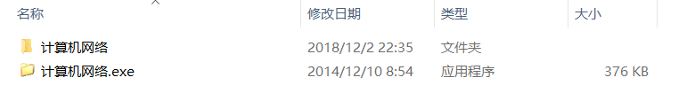
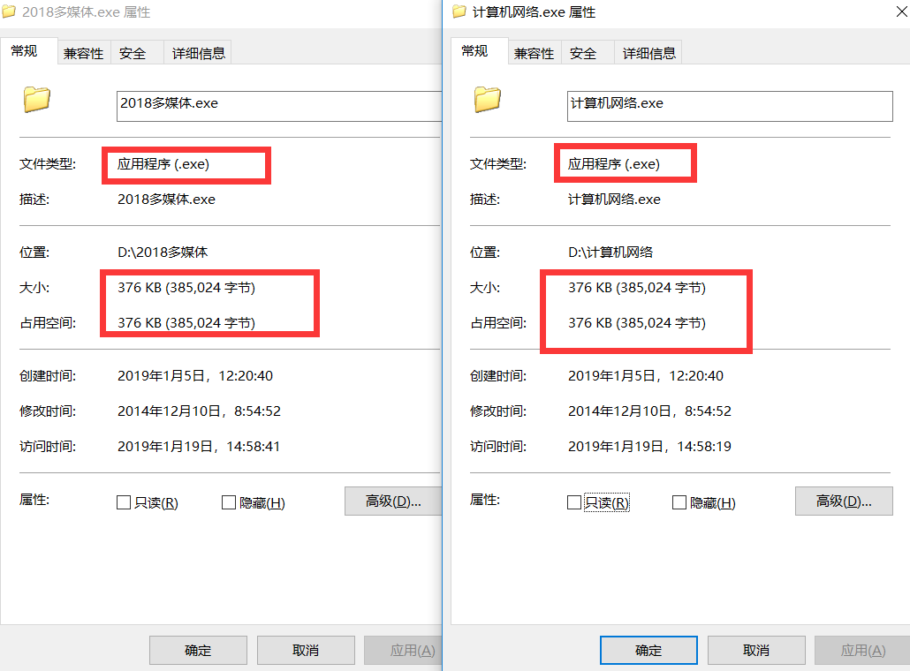

## <span id="wu">病毒分析实战——U盘病毒</span>


### 目录

* [一.前言](#qy)
* [二.手杀病毒](#ss)

### <span id="qy">一.前言</span>

前段时间去学校打印店印资料，如同往常一样，插上我的U盘。奇怪的是这次的连接时间较以往长，并且还出现了`自动播放`窗口。 以前使用U盘，都没有出现过`自动播放`的情况。不过没有我在意，关闭了那个窗口，从`我的电脑`打开了U盘分区。但是在U盘中却发现了奇怪的文件：




这几个文件很奇怪，因为它们都是使用了文件夹的图标，貌似是一个文件夹，但是在文件名称的后面却跟着一个`.exe`的小尾巴。而且，我的U盘中本来确实有这四个文件夹，但是我不记得给他们加上了`.exe`这样的后缀名。而不带后缀名的真实的文件夹却找不到了(图片中显示是因为已经被我处理了)。这就让我很是怀疑，于是分别查看这几个文件的属性。



可见这些文件并不是文件夹，而是应用程序，并且它们的大小一致。看到这里，就可以基本确定了，我的U盘是中了病毒了。

### <span id="ss">二.手杀病毒</span>

初步分析，这个病毒会将自身伪装成我的U盘中本来存在的文件夹，从而诱惑我去点击。那么原始的文件夹是被删除了还是被隐藏了呢？

选择显示隐藏文件之后，那些文件依然没有显示出来，这里可用一个cmd下的命令来显示，因为文件的隐藏其实是基于文件的四个属性值。

隐藏文件(添加四个属性):

> attrib +s +h +a +r 文件名

显示文件(删除四个属性):

> attrib -s -h -a -r 文件名

通过`attrib`命令操作隐藏的文件无法通过常规的`显示文件`来显示，这也是病毒隐藏文件的一个常用途径。


显示出我们原本的文件之后就可将`exe`程序删除了。

U盘病毒其实危害性并没有多强，但其传播速度与对普通人的影响却是很大。

要编写代码进行快速删除也简单，只需要循环遍历U盘目录，将其中子文件进行显示即可。代码如下:

```c
for /f "delims=?" %%a in ('dir /a /b') do attrib -a -s -h -r "%%a"
```

只需要将这一行批处理代码保存为`cmd`后缀名文件，放置U盘跟目录，双击运行即可。