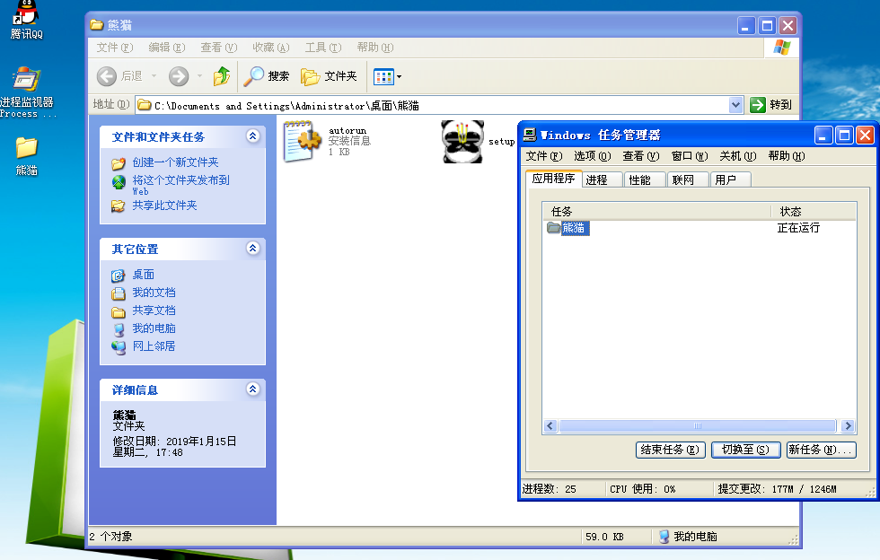
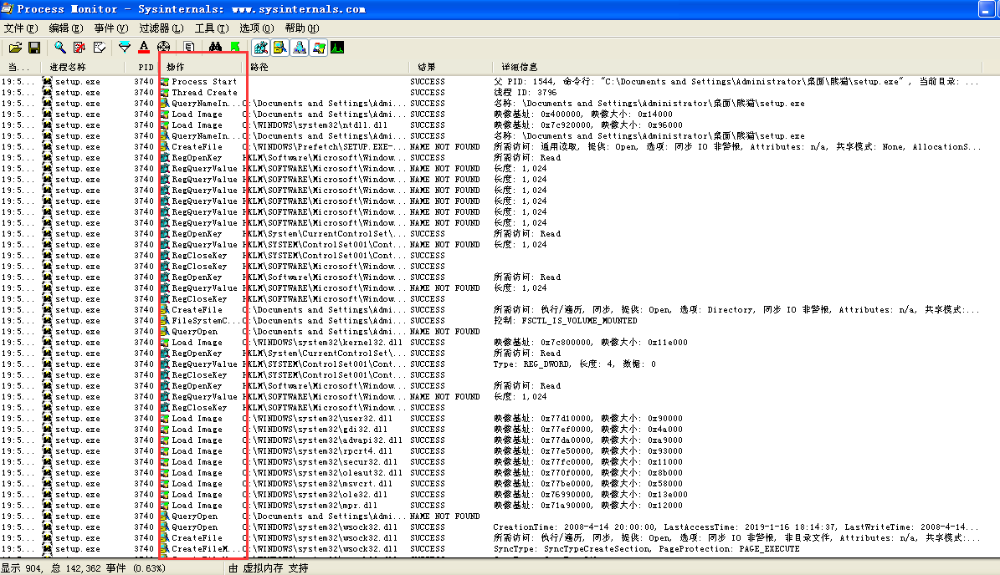
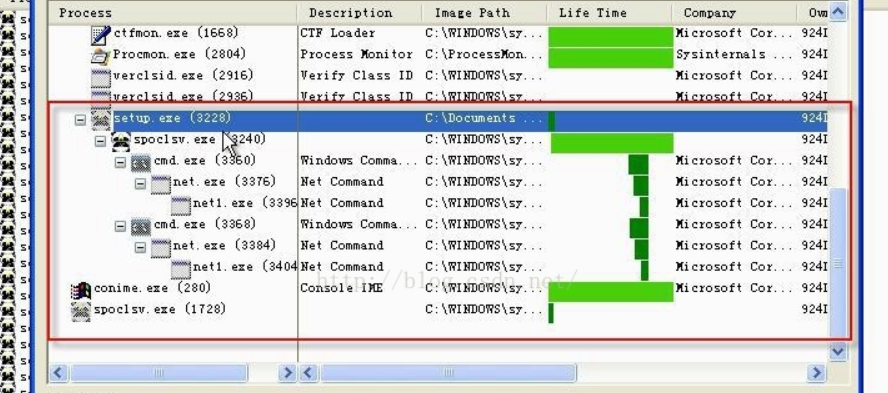
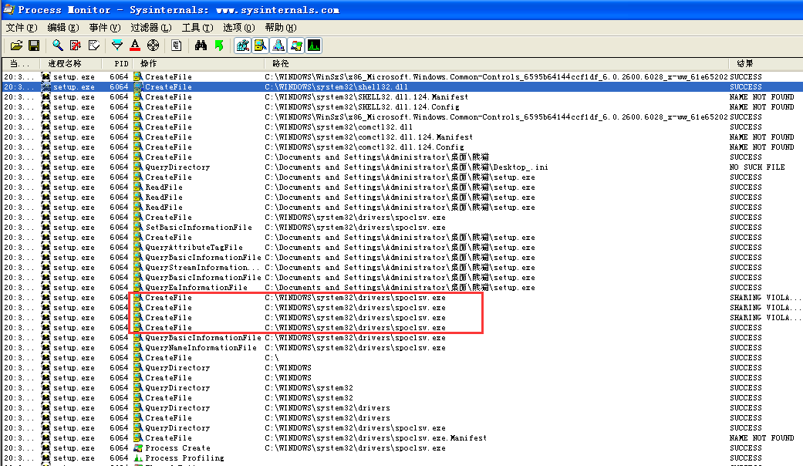
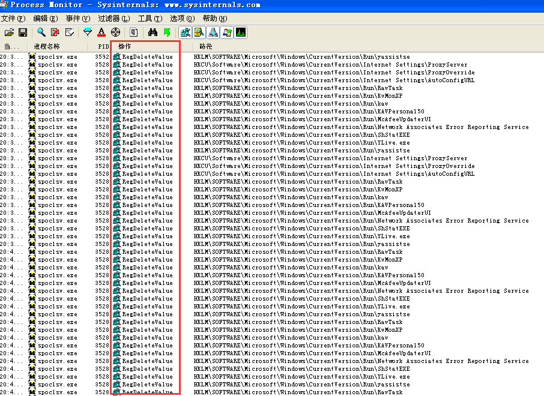
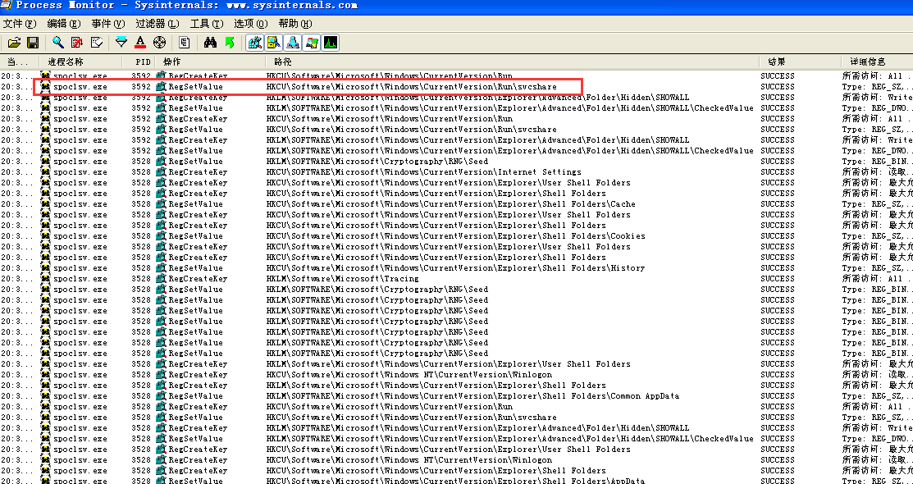
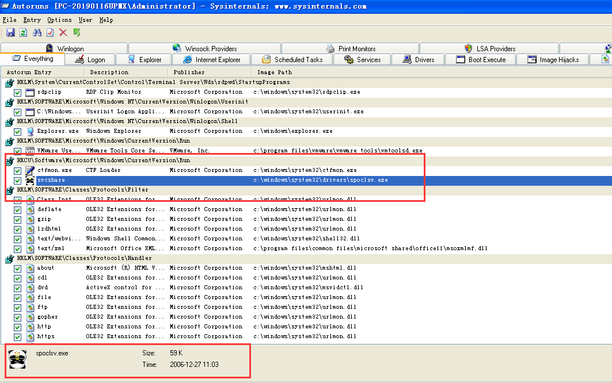
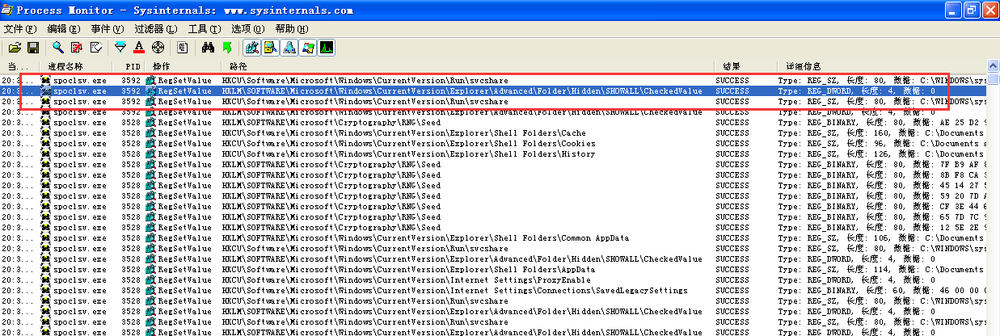
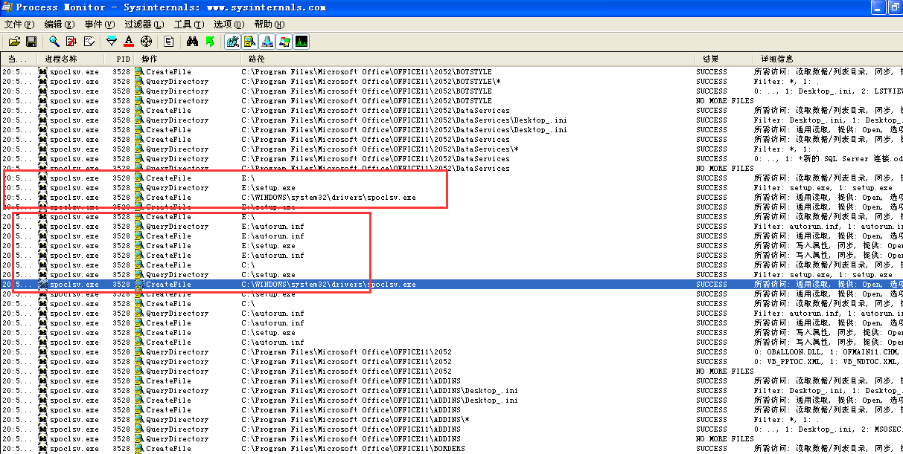
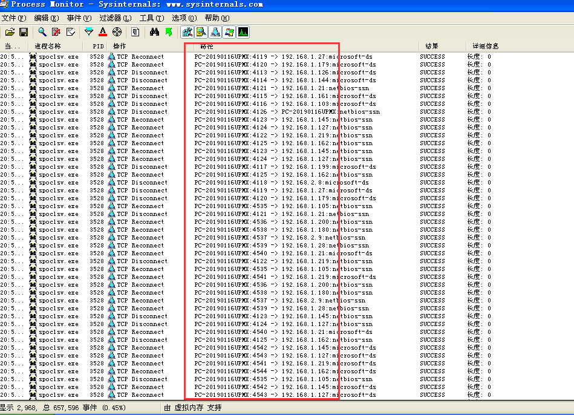

## <span id="wu">手动查杀病毒实战——熊猫烧香病毒</span>

> 如果像自己实践记得在虚拟机下！
> 病毒包可以在Github仓库找到

### 目录

* [一.手动查杀](#step1)
  * [0.病毒分析](#wu0)
    * [1).中毒症状](#wu01)
    * [2).病毒特征](#wu02)
    * [3).发作症状](#wu03)
  * [1. 查内存，排查可疑进程，将病毒从内存中干掉](#wu1)
  * [2. 查启动项，删除病毒启 动项](#wu2)
  * [3. 通过启动项判断病毒所在位置，并从根本上删除病毒](#wu3)
  * [4. 修复系统](#wu4)
* [二.行为分析](#step2)
* [三.逆向分析](#step3)

## <span id="step1">一.手动查杀</span>

### <span id="wu0">0. 病毒分析</span>

病毒名称: `武汉男生`，又名`熊猫烧香病毒`。"Worm.WhBoy.h"

###### <span id="wu01">1).中毒症状</span>
  
* 拷贝自身到所有驱动器根目录，命名为Setup.exe，并生成一个autorun.inf使得用户打开该盘运行病毒，并将这两个文件属性设置为隐藏、只读、系统。

* 无法手工修改“文件夹选项”将隐藏文件显示出来。

* 在每个感染后的文件夹中可见Desktop_ini的隐藏文件，内容为感染日期 如：2007-4-1

* 电脑上的所有脚本文件中加入一段代码：

```html
<iframe src=xxx width=”0” height=”0”></iframe>
```

* 中毒后的机器上常见的反病毒软件及防火墙无法正常开启及运行。

* 不能正常使用任务管理器及注册表。

* 无故的向外发包，连接局域网中其他机器。

* 感染其他应用程序的.exe文件，并改变图标颜色，但不会感染微软操作系统自身的文件。

* 删除GHOST文件(.gho后缀)，网吧、学校和单位机房深受其害。

* 禁用常见杀毒工具。

###### <span id="wu02">2).病毒特征</span>

* 关闭众多杀毒软件和安全工具。

* 循环遍历磁盘目录，感染文件，对关键系统文件跳过。

* 感染所有EXE、SCR、PIF、COM文件,并更改图标为烧香熊猫。

* 感染所有.htm/.html/.asp/.php/.jsp/.aspx文件，添加木马恶意代码。

* 自动删除*.gho文件。

###### <span id="wu03">3).发作症状</span>

1. 拷贝文件

> 病毒运行后,会把自己拷贝到C:\WINDOWS\System32\Drivers\spoclsv.exe

2. 添加注册表自启动

> 病毒会添加自启动项HKEY_CURRENT_USER\Software\Microsoft\Windows\CurrentVersion\Run\svcshare -> C:\WINDOWS\System32\Drivers\spoclsv.exe

3. 病毒行为

* 每隔1秒寻找桌面窗口,并关闭窗口标题中含有以下字符的程序

> QQKav,QQAV,防火墙,进程,VirusScan,网镖,杀毒,毒霸,瑞星,江民,黄山IE,超级兔子,优化大师,木马克星,木马清道夫,QQ病毒,注册表编辑器,系统配置实用程序,卡巴斯基反病毒,Symantec AntiVirus,Duba,esteem proces,绿鹰PC,密码防盗,噬菌体,木马辅助查找器,System Safety Monitor,Wrapped gift Killer,Winsock Expert,游戏木马检测大师,msctls_statusbar32,pjf(ustc),IceSword
并使用的键盘映射的方法关闭安全软件IceSword

并中止系统中以下的进程:

```
Mcshield.exe VsTskMgr.exe naPrdMgr.exe UpdaterUI.exe TBMon.exe scan32.exe
Ravmond.exe CCenter.exe RavTask.exe Rav.exe Ravmon.exe RavmonD.exe
RavStub.exe KVXP.kxp kvMonXP.kxp KVCenter.kxp KVSrvXP.exe KRegEx.exe UIHost.exe TrojDie.kxp
FrogAgent.exe Logo1_.exe Logo_1.exe Rundl132.exe
```

* 每隔18秒

> 点击病毒作者指定的网页,并用命令行检查系统中是否存在共享，存在的话就运行net share命令关闭admin$共享。

* 每隔10秒

> 下载病毒作者指定的文件,并用命令行检查系统中是否存在共享共存在的话就运行net share命令关闭admin$共享。

* 每隔6秒

> 删除安全软件在注册表中的键值。

```
HKEY_LOCAL_MACHINE\SOFTWARE\Microsoft\Windows\CurrentVersion\Run
RavTask KvMonXP kav KAVPersonal50 McAfeeUpdaterUI Network Associates Error Reporting Service ShStartEXE YLive.exe yassistse
```

> 并修改以下值不显示隐藏文件

```
HKEY_LOCAL_MACHINE\SOFTWARE\Microsoft\Windows\CurrentVersion\Explorer\Advanced\Folder\Hidden\SHOWALL\CheckedValue

修改为 0x00
```

> 删除以下服务

```
navapsvc wscsvc KPfwSvc SNDSrvc
ccProxy ccEvtMgr ccSetMgr SPBBCSvc
Symantec Core LC NPFMntor MskService FireSvc
```

* 感染文件

> 病毒会感染扩展名为exe,pif,com,src的文件,把自己附加到文件的头部并在扩展名为htm,html, asp,php,jsp,aspx的文件中添加一网址,用户一旦打开了该文件,IE就会不断的在后台点击写入的网址,达到增加点击量的目的,但病毒不会感染以下文件夹名中的文件,防止系统崩溃。

```
WINDOW
Winnt
System Volume Information
Recycled
Windows NT
WindowsUpdate
Windows Media Player
Outlook Express
Internet Explorer
NetMeeting
Common Files
ComPlus Applications
Messenger
InstallShield Installation Information
MSN
Microsoft Frontpage
Movie Maker
MSN Gamin Zone
```

### <span id="wu1">1. 查内存，排查可疑进程，将病毒从内存中干掉</span>

在虚拟机中运行熊猫烧香病毒，记得要在xp虚拟机啊，物理机现在Windows补丁已经免疫熊猫烧香了。


在虚拟机中我们打开任务管理器，发现刚一打开就会被关闭，这是熊猫烧香的特征之一。


右键一个分区，你会发现第一项不是打开，而是`Auto`，这是因为熊猫烧香病毒会在分区产生一个`autorun.inf`文件使得用户打开该盘运行病毒，`autorun.inf`文件是系统,隐藏文件。

> 甚至一些病毒会把Auto起名为打开，右键分区你会发现两个`打卡`选项。

我们第一步就要先关闭病毒进程，排查内存时我们需要使用`tasklist`命令查看可疑进程，`spoclsv.exe`就是熊猫烧香的进程名了(这个可能需要大量的积累，最好是对Windows系统进程有大量了解)。

找到后通过`taskkill /f /im PID`命令将其终止

> 有些病毒无论任务管理器还是taskkill命令都无法将其终止，这类病毒大多是有三个进程相互保护，有一个被终止后其他进程会立即再次启动这个进程。


### <span id="wu2">2. 查启动项，删除病毒启动项</span>

将病毒从内存中清除之后，接下来我们要删除其服务和启动项。


在禁用删除掉启动项之前，我们需要先记住这个病毒的路径，以便第三步去删除它的主体。

### <span id="wu3">3. 通过启动项判断病毒所在位置，并从根本上删除病毒</span>

下图就是熊猫烧香病毒本体的位置了，其实但看启动项中exe路径就能发现spoclsv服务的可疑了，它位于system32\drivers下，也不是一些常见的系统服务。


到这个路径下删除这个exe程序。

### <span id="wu4">4. 修复系统</span>

删除完exe之后我们重启系统，会发现现在系统中没有spoclsv.exe这个进程了。

这时病毒还有可能会复发，因为系统还未完成修复，之前说的分区双击默认选项可能会导致病毒程序再次运行。

我们需要将Auto选项删除，并且清理系统。


`autorun.inf`就是关联我们右键菜单的文件了。

我们通过`attrib -s -h -a -r autorun.inf`来分别将`autorun.inf`和`setup.exe`隐藏属性删除并且删除这两个文件。


删除之后我们双击分区打开会发现无法生效。


注销系统后，右键菜单恢复。


## <span id="step2">二.行为分析</span>

> 使用Process Monitor进程树分析病毒运行后的操作。

在病毒程序启动之前，任务管理器还可以打开。



设置Process Monitor进程过滤，进程名选择`熊猫烧香.exe`。



过滤结果中可以看到运行的`setup.exe`程序，后面跟随有进程操作，其中操作多为`进程创建`和大量的`注册表操作`。

打开进程树查看`setup.exe`进程信息。



在进程树中可以发现，`setup.exe`衍生出了`spoclsv.exe`。衍生出的进程又打开了两次`cmd.exe`。第一次运行的命令是`cmd.exe /c net share C$ /del /y`，它的意思是在命令行模式下删除C盘的网络共享，执行完后关闭cmd.exe。因此这个病毒应该是会关闭系统中所有的盘的网络共享。第二次运行的命令是`cmd.exe /c net share admin$ /del /y`，这里取消的是系统根目录的共享。那么由此就可以总结出病毒的两点行为：

* 行为1：病毒本身创建了名为`spoclsv.exe`的进程，该进程文件的路径为`C:\WINDOWS\system32\drivers\spoclsv.exe`。

* 行为2：在命令行模式下使用`net share`命令来取消系统中的共享。

之后对`setup.exe`文件操作监控分析，分析操作为`CreateFile`的`Path`，



可见，`熊猫烧香.exe`在`C:\WINDOWS\system32\drivers`中创建了`spoclsv.exe`，其它再无可疑操作，那么可以认为，这个病毒真正的破坏部分是由`spoclsv.exe`实现的，那么接下来的工作就是专门监控这个进程。

这里需要将进程名为`spoclsv.exe`的进程加入筛选器进行分析。`spoclsv.exe`作为病毒主体所产生的操作会比较多。



可见病毒进程会尝试删除大量安全类软件的注册表启动项。

* 行为3：删除安全类软件在注册表中的启动项。

然后只保留`RegCreateKey`与`RegSetValue`进行分析：



可见，病毒程序为自身创建了自启动项，详细信息为`Type: REG_SZ, 长度: 80, 数据: C:\WINDOWS\system32\drivers\spoclsv.exe`，使得每次启动计算机就会执行自身，可以查看该路径启动项来验证，因为病毒进程会自动关闭任务管理器和注册表，所以我们需要借助第三方工具`autorun`来查看。



* 行为4：在注册表`HKCU\Software\Microsoft\Windows\CurrentVersion\Run`中创建`svcshare`，用于在开机时启动位于`C:\WINDOWS\system32\drivers\spoclsv.exe`的病毒程序。

接下来还有：



对注册表`KLM\SOFTWARE\Microsoft\Windows\CurrentVersion\Explorer\Advanced\Folder\Hidden\SHOWALL\CheckedValue`这个位置设置为`0`，能够实现文件的隐藏。此处进行设置后，即便在`文件夹选项`中选择`显示所有文件和文件夹`，也无法显示隐藏文件，则有：

* 行为5：修改注册表，使得隐藏文件无法通过普通的设置进行显示，该位置为：`HKLM\SOFTWARE\Microsoft\Windows\CurrentVersion\Explorer\Advanced\Folder\Hidden\SHOWALL`，病毒将`CheckedValue`的键值设置为了`0`。

接下来对`spoclsv.exe`文件监控分析，主要看的是病毒是否将自己复制到其他目录，或者创建删除了哪些文件等，监控如下所示：



在图中可以看到，病毒文件在`C:\WINDOWS\system32\drivers`中创建了`spoclsv.exe`这个文件，在C盘和E盘根目录下创建了`setup.exe`与`autorun.inf`，并且在一些目录中创建了`Desktop_.ini`这个文件。由于创建这些文件之后就对注册表的SHOWALL项进行了设置，使得隐藏文件无法显示，那么有理由相信，所创建出来的这些文件的属性都是“隐藏”的，于是有：

* 行为6：将自身拷贝到根目录，并命名为`setup.exe`，同时创建`autorun.inf`用于病毒的启动，这两个文件的属性都是`隐藏`。

* 行为7：在一些目录中创建名为`Desktop_.ini`的隐藏文件。

最后对`spoclsv.exe`进行网络监控分析，来查看病毒是否有联网动作。



从监控结果可以看到，病毒不断尝试连接`192.168.1.X`即局域网中的其它计算机。

* 行为8：向外发包，连接局域网中其他机器。

## <span id="step3">三.逆向分析</span>

